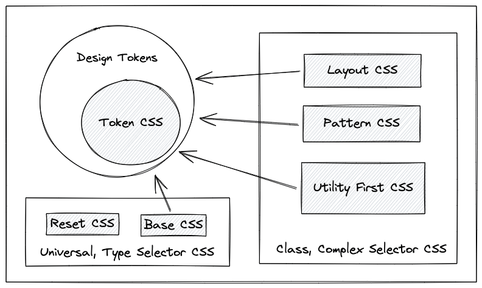

#

Zero-dependency, Framework-agnostic collection of CSS and UI implementations.

## Slogan

Plain old CSS is enough.

## Files and their roles

- reset.css
  - Reduce the complexity
- base.css
  - Add basic things
- token.css
  - Manage design tokens by [CSS custom properties](https://developer.mozilla.org/en-US/docs/Web/CSS/--*)
- utility.css
  - Utility-First CSS
- layout.css
  - Create layouts
- pattern.css
  - Create common UI

## Benefits

You can build a design system that doesn't rely on any UI library. This approach minimizes the long-term maintenance costs. Since it works with any UI library, you can maximizes your freedom of choice.

## Demerits

You need to write all CSS stuff. Learning CSS is essential.
